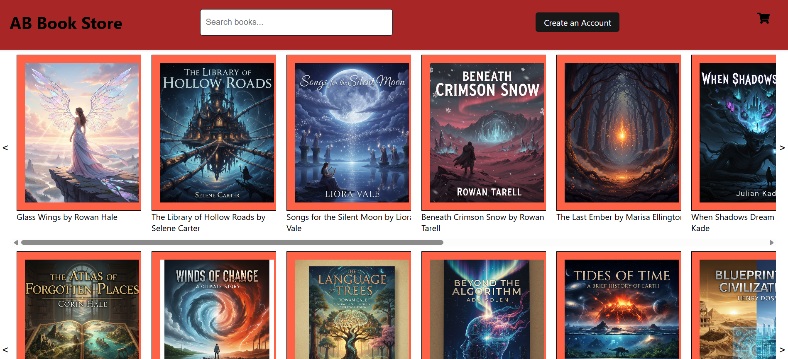

A work-in-progress e-commerce bookstore built using React for the frontend and Django for the backend. This application allows users to browse books fetched dynamically from a PostgreSQL database and will eventually support full shopping cart functionality and checkout.

**Project Goals** 
 Display books dynamically from backend ✅ 
 Admin panel for inventory management ✅ 
 User authentication and registration ✅ 
Create a book detail page🚧(WIP) 
 Shopping cart and checkout system 🔴 
 Stripe or PayPal integration for payments 🔴 
 A review system, where users can leave reviews and rate a book. 🔴 
 
**Technology Used** 
Frontend: React, JavaScript, Axios, CSS, html  
Backend: Django, Django REST Framework 
Database: PostgreSQL 
API Communication: REST API  

  
Home Page of the App 

